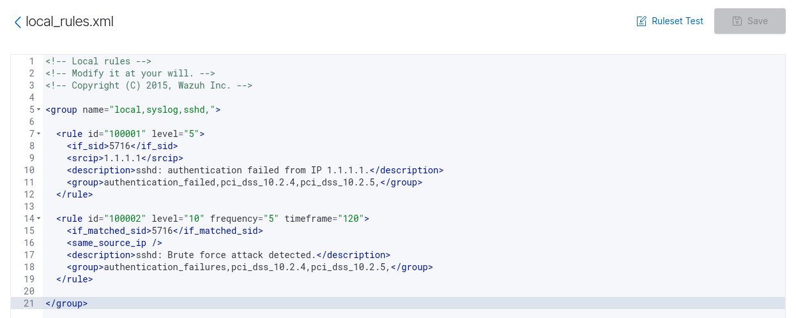

# Wazuh Supervision Lab

Projet de supervision sécurité basé sur Wazuh, déployé via Docker. L'objectif est de surveiller un serveur Ubuntu cible en créant des règles de détection personnalisées pour deux scénarios : les attaques par force brute SSH et la création de nouveaux utilisateurs système.

---

## Ce que fait ce lab

- Wazuh Manager + Dashboard déployés via Docker
- Agent Wazuh installé sur une VM Ubuntu cible
- Règles personnalisées créées directement depuis l'interface graphique

---

## Comment j'ai créé les règles (Dashboard Wazuh)

### Accéder à l'éditeur

```
Menu → Management → Rules
```

### Règles SSH — fichier `local_rules.xml`

La règle 100001 détecte un échec de connexion SSH depuis une IP précise. La règle 100002 se déclenche quand la même IP échoue 5 fois en 2 minutes — c'est là que l'alerte force brute remonte.

```xml
<rule id="100001" level="5">
  <if_sid>5716</if_sid>
  <srcip>1.1.1.1</srcip>
  <description>sshd: authentication failed from IP 1.1.1.1.</description>
  <group>authentication_failed,pci_dss_10.2.4,pci_dss_10.2.5,</group>
</rule>

<rule id="100002" level="10" frequency="5" timeframe="120">
  <if_matched_sid>5716</if_matched_sid>
  <same_source_ip />
  <description>sshd: Brute force attack detected.</description>
  <group>authentication_failures,pci_dss_10.2.4,pci_dss_10.2.5,</group>
</rule>
```



### Règle création d'utilisateur — fichier `Détection_création_d'utilisateur`

La règle 100004 se déclenche dès qu'un nouvel utilisateur est créé sur le système.

```xml
<rule id="100004" level="10">
  <if_sid>5902</if_sid>
  <match>Nouvel utilisateur</match>
  <description>Nouvel utilisateur créé sur le système</description>
  <mitre>
    <id>T1136</id>
  </mitre>
  <group>user_management</group>
</rule>
```


Après chaque modification, cliquer sur **Save** et confirmer le redémarrage du Manager.

---

## Voir les alertes

```
Menu → Security Events
```

Filtrer par `rule.id : 100002` pour la force brute, ou `rule.id : 100004` pour la création d'utilisateur.


---

## Récapitulatif des règles

| ID     | Fichier                           | Description                            | Niveau |
|--------|-----------------------------------|----------------------------------------|--------|
| 100001 | local_rules.xml                   | Echec SSH depuis IP 1.1.1.1            | 5      |
| 100002 | local_rules.xml                   | Force brute SSH (5 échecs / 2 min)     | 10     |
| 100004 | Détection_création_d'utilisateur  | Nouvel utilisateur créé sur le système | 10     |

---

## Stack technique

- Wazuh 4.x — Docker / Docker Compose
- Ubuntu Server 22.04 LTS
- OpenSSH

## Documentation officielle

- [Déploiement Wazuh via Docker](https://documentation.wazuh.com/current/deployment-options/docker/wazuh-container.html)
- [Installation de l'agent Wazuh](https://documentation.wazuh.com/current/installation-guide/wazuh-agent/wazuh-agent-package-linux.html)
